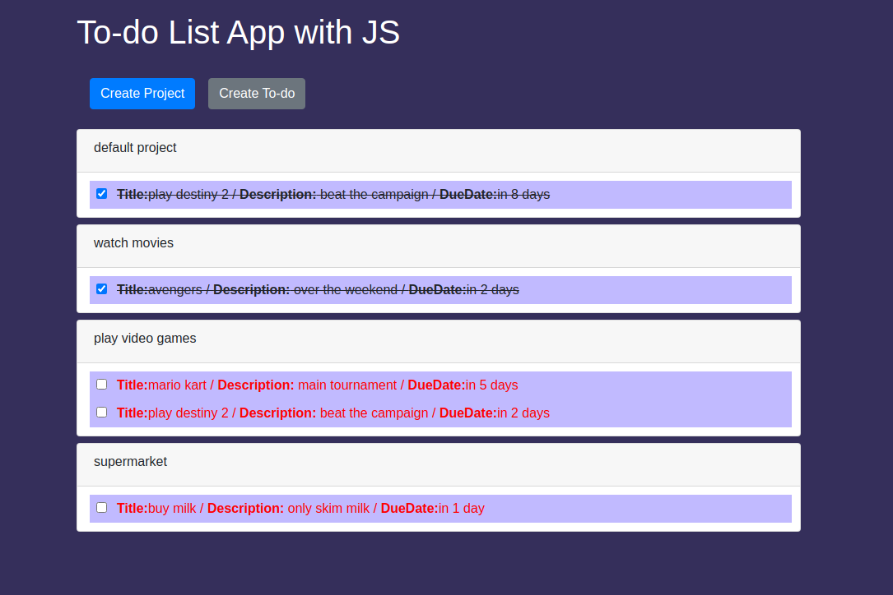

# Project Todo-List

> For this project we need to create a todo list

## Built With

- Bootstrap
- Javascript

## Live Demo

[Live Demo Link](https://rawcdn.githack.com/cvilla714/list/2d7d50834770fd5e9d7f2a3b5203a9db841d2e85/dist/index.html)

## Getting Started

**To get a copy of the code please click on the green button on the top right corner that says code**
**And run in your console `git@github.com:cvilla714/list.git`**

### Prerequisites

- Npm
- Node.js
- VS Code

### Install

**Once you have downloaded the code please run this command in your terminmal `npm install` this will**
**install all of the dependecies for the project to run**

### Usage

**To look at the code woking please run this command `npm run start` this will open a new page in your webbrowser**
**where you will see the app working**

## Authors

👤 **Alejandro Toledo**

- GitHub: [@alejandrotoledoweb](https://github.com/alejandrotoledoweb)
- Twitter: [@alejot](https://twitter.com/alejot)
- LinkedIn: [Alejandro Toledo](https://www.linkedin.com/in/alejandro-toledo-3b444b109/)

👤 **Author2**

- GitHub: [@cvilla714](https://github.com/cvilla714)
- Twitter: [@kckeyti](https://twitter.com/kckeyti)
- LinkedIn: [Cosmel Villalobos](https://www.linkedin.com/in/cosvilla/)

## 🤝 Contributing

Contributions, issues, and feature requests are welcome!

Feel free to check the [issues page](https://github.com/cvilla714/list/pulls).

## Show your support

Give a ⭐️ if you like this project!

## 📝 License

This project is [MIT](https://github.com/cvilla714/list/blob/master/LICENSE) licensed.
